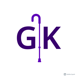

# GeriKit

An iOS mobile app to help assist with geriatric screening.

This application is a tool to help medical professionals facilitate a geriatric examination. The app includes tests for eight indicators to diagnose a patient's geriatric health. These indicators include Cognition, Depression, Function, Strength, Fall Risk, Nutrition, Medications, and Advance Care. 

Disclaimer:
This application is intended to facilitate discussion between patients and healthcare professionals. It is not intended as a substitute for professional medical judgment, diagnosis, or treatment. It should not be used by patients without direct consultation with, and supervision by, their healthcare provider.

### Development 
This app is developed using Swift. 

### Support 
For application questions or issues, contact aviswanath4@gmail.com.

© Ambika Viswanathan, NYU Grossman School of Medicine, 2020
